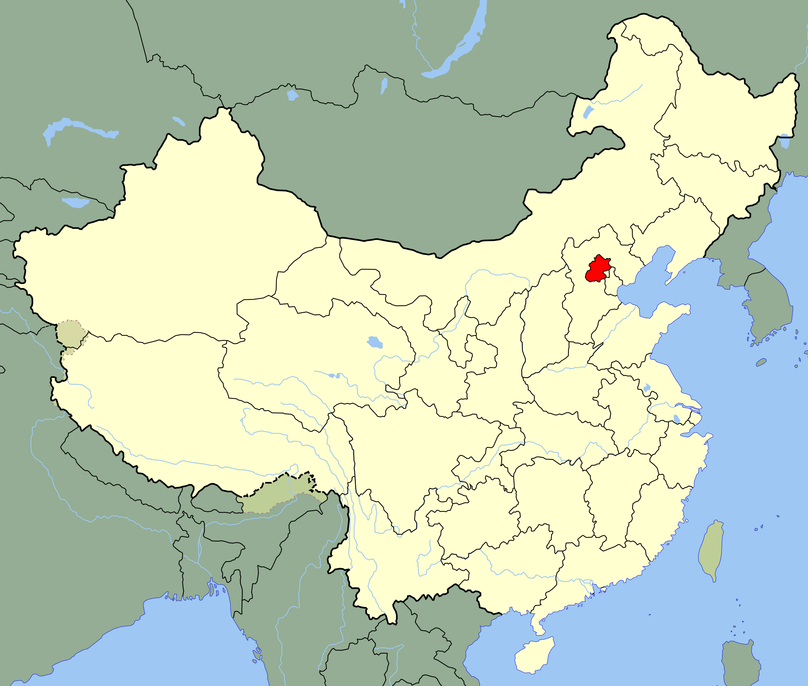
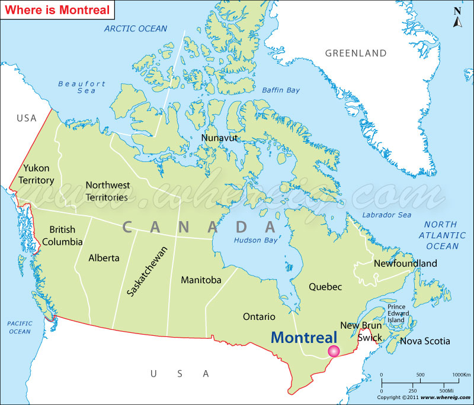
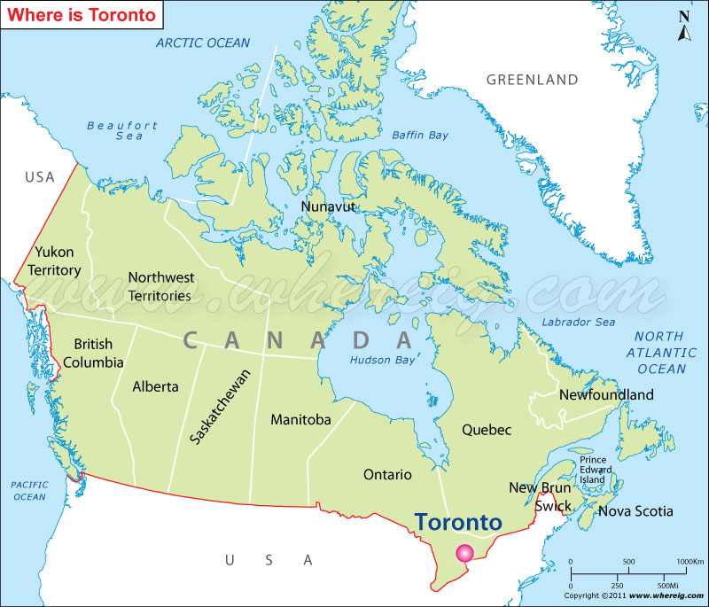

A little bit more about me:

* Virgo

* Enjoy drawing, hiking, swimming, and badminton

### My timeline

1999: Born in China:
<center>
<br><br><br>
</center>

```{r, echo=FALSE, out.width="49%", out.height = "20%",fig.cap="Beijing City and Forbidden City",fig.show='hold',fig.align='center'}
knitr::include_graphics(c("image/beijing1.jpeg","image/beijing2.webp"))
```

&nbsp;

2004: Moved to Montreal, Canada:
<center>
<br><br><br>
</center>
```{r, echo=FALSE, out.width="49%", out.height = "20%",fig.cap="Montreal City and Sugar Shack",fig.show='hold',fig.align='center'}
knitr::include_graphics(c("image/montreal1.jpeg","image/montreal2.png"))
```

&nbsp;

2013: Moved to Toronto, Canada:
<center>
<br><br><br>
</center>

```{r, echo=FALSE, out.width="49%", out.height = "20%",fig.cap="Toronto City and Western University",fig.show='hold',fig.align='center'}
knitr::include_graphics(c("image/toronto1.jpeg","image/uwo.png"))
```

&nbsp;

2021: Moved to New York, USA:
<center>
<br><br><br>
</center>
```{r, echo=FALSE, out.width="49%", out.height = "20%",fig.cap="New York City and Washington Bridge",fig.show='hold',fig.align='center'}
knitr::include_graphics(c("image/nyc.jpeg","image/bridge.webp"))
```
